# Plantify Chatbot Project

## Overview

The Plantify Chatbot is a multi-agent conversational AI designed to assist users with inquiries and orders related to a plant shop. This chatbot is built to provide information about the shop, its products, and to facilitate the order-taking process.

## Features

- **Multi-Agent Architecture**: The chatbot uses a modular design with specialized agents for different tasks:
  - **Guard Agent**: Filters user inputs for inappropriate or out-of-scope queries.
  - **Classification Agent**: Determines which agent should handle a user's request (details or order-taking).
  - **Details Agent**: Provides information about the plant shop, such as location, hours, and product details.
  - **Order Taking Agent**: Manages the order-taking process, including product selection, cart management, and order confirmation.
- **Order Management**:
  - Users can add products to their cart.
  - The chatbot calculates the total order amount, including discounts.
- **Product Catalog**: The chatbot has access to a catalog of plants and related products, including prices.
- **Contextual Conversation**: The chatbot maintains conversation history to provide relevant and contextual responses.
- **Knowledge Base**: The Details Agent uses a knowledge base to answer user queries about the shop.
- **Input Validation**: The Guard Agent ensures that user inputs are appropriate and relevant to the plant shop.
- **Error Handling**: The application includes error handling to gracefully manage unexpected issues.
- **Conversational UI**: The chatbot is integrated with a Streamlit-based user interface.

## Tools & Technologies

- **Programming Language**: Python
- **Framework**: Streamlit (for the user interface)
- **LLM Interaction**: Boto3 (for interacting with AWS Bedrock)
- **LLM Model**: Mistral 7B Instruct
- **Environment Management**: dotenv (for managing environment variables)
- **Data Structures**: JSON (for data exchange)
- **Text Processing**: difflib (for fuzzy matching)
- **AWS Services**:
  - Bedrock
- **Key Concepts**:
  - Multi-agent architecture
  - Conversational AI
  - Natural Language Processing (NLP)
  - Contextual awareness
  - State management

## Project Structure

The project is organized into the following files:

- `main.py`: The main application file that sets up the Streamlit UI and initializes the agents.
- `router.py`: The router agent that directs user messages to the appropriate agent.
- `guard_agent.py`: The guard agent that filters user inputs.
- `classification_agent.py`: The classification agent that determines the appropriate agent to handle user requests.
- `details_agent.py`: The details agent that provides information about the plant shop.
- `order_taking_agent.py`: The order-taking agent that handles the order process.
- `utils.py`: Contains utility functions (not provided, but assumed to exist).

## How to Run the Application

1.  **Set up AWS Credentials**: Configure your AWS credentials to access the Bedrock service.
2.  **Install Dependencies**: Install the required Python packages. (A `requirements.txt` file was not provided, so list the dependencies you used, e.g., `pip install streamlit boto3 python-dotenv`)
3.  **Set Environment Variables**: Create a `.env` file in the root directory and add the following:
    ```
    AWS_REGION=<your_aws_region>
    BEDROCK_MODEL_NAME=mistral.mistral-7b-instruct-v0:2
    ```
    Replace `<your_aws_region>` with your AWS region.
4.  **Run the Application**: Run the `main.py` script using Streamlit:
    ```
    streamlit run main.py
    ```
5.  **Interact with the Chatbot**: The chatbot interface will appear in your web browser. You can type your questions or order requests in the chatbox.

## Code Highlights

- **Agent Routing**: The `RouterAgent` class in `router.py` manages the flow of messages between different agents. It uses a guard agent to filter out-of-scope queries, a classification agent to determine the intent, and then routes to either the details agent or the order-taking agent.
- **Order Taking**: The `OrderTakingAgent` in `order_taking_agent.py` handles the complexities of order management, including product selection, quantity, and total price calculation.
- **Context Management**: Agents maintain context through the `messages` list, allowing the chatbot to understand the ongoing conversation.
- **Knowledge Retrieval**: The `DetailsAgent` in `details_agent.py` loads information from external documents to answer user questions about the plant shop.
- **Input Validation**: The `GuardAgent` in `guard_agent.py` ensures that user inputs are safe and relevant.

## Future Improvements

- **Enhance Knowledge Base**: Expand the knowledge base for the `details_agent` to include more information about plants, care tips, and gardening advice.
- **Implement User Authentication**: Add user authentication to personalize the shopping experience and store order history.
- **Integrate Payment Gateway**: Integrate a payment gateway to allow users to complete their orders within the chatbot interface.
- **Improve Error Handling**: Implement more robust error handling and logging.
- **Add More Tests**: Add unit and integration tests to ensure the reliability of the chatbot.
- **Optimize Performance**: Explore ways to optimize the performance of the chatbot, such as caching or asynchronous processing.
- **Support for more LLMs**: The code uses Mistral 7B, but could be expanded to use other LLMs.
- **Add a vector store**: The details agent could use a vector store to make knowledge retrieval more efficient.

## 🏗 How It Works

###  Multi-Agent Architecture

```mermaid
graph LR
    A[User Query] --> B{Guard Agent}
    B -->|Allowed| C[Classifier Agent]
    B -->|Blocked| D["🚫 Sorry, I can't help with that"]
    C -->|"Order?"| E[Order Agent]
    C -->|"Info?"| F[Details Agent]
    E --> G["🛒 Cart Updated!"]
    F --> H["🌱 Snake Plants love indirect sunlight!"]
```


